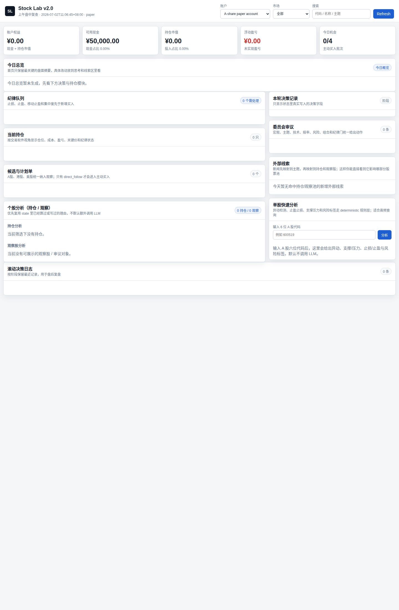
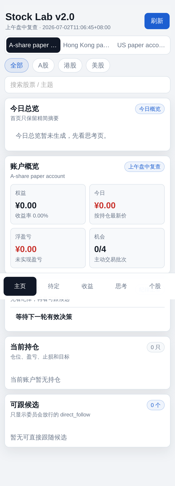

# Stock Lab Framework

> **免责声明 / Disclaimer**
>
> 本项目仅作为**本地部署的股票研究、状态可视化与模拟交易框架**，用于技术交流、界面实验、策略工程练习与个人学习。
>
> - **不构成任何投资建议、证券推荐或收益承诺**
> - **不提供实盘托管、代客理财或自动荐股服务**
> - 使用者应自行判断、自行承担风险，并在接入真实资金前完成独立验证、风控与合规评估
>
> This repository is provided for **educational and framework-sharing purposes only**. It is **not financial advice**.

一个面向本地部署的股票研究与模拟交易框架。它不是“只会出信号的脚本”，而是一个把**持仓状态、复盘过程、决策链路、个股分析与异动识别**放进同一套看板里的研究工作台。

你可以把它理解成一个适合自己长期迭代、也适合交给 agent 协助定制的本地 stock dashboard framework。

## 它主要在解决什么痛点

很多个人投资者、尤其是**小仓位账户**，现实里会碰到一个很尴尬的问题：
- 仓位不大，通常**开不通量化自动交易**或不值得上重型基础设施
- 想系统化复盘、跟踪和执行，但又不想只是手工记几条笔记
- 想学习别人的框架、做半跟投、再逐步长成自己的体系

这个项目的定位就是为这类场景服务：
- **学习**：把持仓、复盘、个股分析、异动识别放进统一界面
- **跟投/观察**：更清楚地区分已执行动作、观察标的和决策理由
- **自我进化**：让你可以持续调整规则、风控、界面和数据源，慢慢长成自己的系统

它不是券商自动化实盘系统，更像一个适合本地部署、长期打磨的研究与执行辅助框架。

## 功能亮点

### 1. 持仓详情与执行视角
- 展示当前持仓、仓位变化、账户状态与关键风险信息
- 区分“当前持仓”“今日实际动作”“候选/观察标的”，避免语义混在一起
- 可用于盘中看状态，也可用于收盘后回看执行结果

### 2. 每晚复盘与学习闭环
- 支持 nightly review / end-of-day reflection 风格的复盘流程
- 将当日动作、纪律执行、观察结论和次日关注点串起来
- 不只是记流水账，而是帮助你沉淀“今天为什么这么做”

### 3. 思路展示与决策链路
- 看板不只给结果，也尽量展示 reasoning / thought flow
- 可把候选标的、动作倾向、风险约束、优先级判断串成可追踪链路
- 更适合自己复盘，也更适合让别人理解系统为何给出这个动作

### 4. 个股分析面板
- 支持对持仓股、观察股做结构化分析
- 可展示止盈/止损、关注位、失效条件、监控要点等信息
- 适合把“这只股票现在该看什么”沉淀成可直接浏览的卡片

### 5. 六位代码即查的个股分析
- 输入 A 股六位代码后，可走 deterministic Python + market data 的分析流程
- 默认不依赖 LLM 长文输出，而是根据价格、均线、偏离、量能等规则生成结果
- 更适合作为日常查询入口，也更容易自己验证和二次修改

### 6. 异动分析与信号识别
- 支持基于历史行情与实时数据做异动识别
- 可用于发现偏离、放量、趋势变化、接近关键位等情况
- 适合做快速筛查，而不是只看一堆原始 K 线

### 7. 多市场与本地部署友好
- 支持多市场 watchlist（A / HK / US）
- 提供 desktop dashboard 与 mobile dashboard
- 适合本地部署、自己改策略、自己接数据源，也适合让自己的 agent 代你做配置和二次开发

## 这个仓库适合谁

- 想搭一个自己的股票研究/复盘/模拟交易看板的人
- 想把“持仓、复盘、理由、异动、个股分析”放在一个统一界面里的人
- 想让自己的 agent 帮忙改配置、接数据源、调 UI、写策略规则的人

## Screenshots

以下截图来自 **public framework 的本地示例状态**，用于展示界面结构与信息层次；不包含作者真实持仓、私有复盘或个人交易记录。

### Desktop dashboard



### Mobile dashboard



## 典型使用场景

### 1. 盘前准备
- 看 watchlist、候选标的、优先级和风险约束
- 先明确今天重点看什么，而不是开盘后临时乱切

### 2. 盘中看持仓与动作
- 通过持仓详情、账户状态、今日实际动作快速判断系统当前处于什么状态
- 区分“已经执行了什么”和“只是正在观察什么”

### 3. 收盘后做 nightly review
- 回看当天动作、纪律执行、思路变化与次日关注点
- 把执行结果和复盘过程沉淀成可追踪记录

### 4. 单只股票快速查询
- 输入六位 A 股代码，快速查看规则化个股分析
- 适合临时想看某只股票是否有异动、是否接近关键位、是否值得继续跟踪

### 5. 交给自己的 agent 做二次开发
- 让 agent 帮你改配置、接数据源、换 UI、加风控规则、改策略逻辑
- 这个 public repo 的定位就是 framework：你带自己的策略与偏好，它负责提供底座

## 目录结构

```text
stock_lab/
├── core/
├── static/
├── tests/
├── scripts/
├── .env.example
├── config.example.json
└── PROJECT_AUDIT.md
```

## 安装

### Linux

```bash
python3 -m venv .venv
.venv/bin/python -m ensurepip --upgrade
.venv/bin/python -m pip install -r requirements.txt
```

### Windows

```bash
python -m venv .venv
.venv\Scripts\python -m ensurepip --upgrade
.venv\Scripts\python -m pip install -r requirements.txt
```

## 启动

生成状态：

```bash
.venv/bin/python trading_engine.py
```

启动看板（推荐，固定使用项目自己的解释器，不吃当前 shell 的 PATH 污染）：

```bash
./scripts/start-dashboard.sh
```

如果要改端口：

```bash
STOCK_LAB_PORT=8877 ./scripts/start-dashboard.sh
```

默认地址：

- `http://127.0.0.1:8765/dashboard`
- `http://127.0.0.1:8765/m`
- `http://127.0.0.1:8765/api/state`

## 环境排查

如果怀疑 `python/pip` 串了环境，运行：

```bash
./scripts/env-doctor.sh
```

安装依赖时，优先使用：

```bash
.venv/bin/python -m pip install <package>
```

不要盲信裸 `pip install`，否则很容易装进别的虚拟环境。

## 配置方式

复制示例配置后，按自己的市场、观察池和风险参数调整：

```bash
cp config.example.json config.json
```

说明：`config.example.json` 里的示例标的只使用宽基 / 指数 ETF 作为占位样本，目的是帮助你验证流程，不代表任何个股或交易推荐。

然后修改：

- `markets`
- `watchlists`
- `capital`
- `risk`
- `execution`

## 测试

```bash
.venv/bin/python -m unittest discover -s tests
```

## 二次开发建议

如果你想把它做成自己的系统，优先改这几层：

1. `core/config.py`：默认参数与账户结构
2. `core/market_data.py`：接入你信任的数据源
3. `core/strategy.py`：候选评分与进场逻辑
4. `core/discipline.py`：风控与退出规则
5. `static/`：UI 风格与页面布局

## 风险提示

更完整的英文免责声明见 [`DISCLAIMER.md`](./DISCLAIMER.md)。

这个项目当前是：

- **研究工具**
- **模拟交易框架**
- **风险与状态可视化面板**

它不是：

- 券商实盘交易系统
- 投资建议服务
- 收益承诺工具

如要接入实盘，至少还需要：

- broker adapter
- 权限隔离
- 二次确认
- 风险熔断
- 完整日志审计
- 异常回滚与告警
